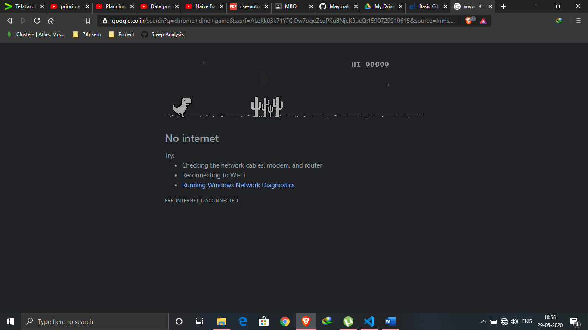

# **Chrome-Dino-Game**

This is an **AUTOMATION** of the Chrome Dino Game using Python3.

# **Libraries used:**

-   PyAutoGui

-   Pillow

-   Time

# **Screen Size:**

>    # **1366x768**
>       Screen Width: **1366 pixels**
>       Screen Height: **768 pixels**

\*\*Note: This game will work on this particular screen size with a
maximized browser window. For other screen sizes, the values in the for
loop must be adjusted. Use the DEMO DRAWING part in the
*main* method to visualize the rectangle in front of the
Dinosaur.
